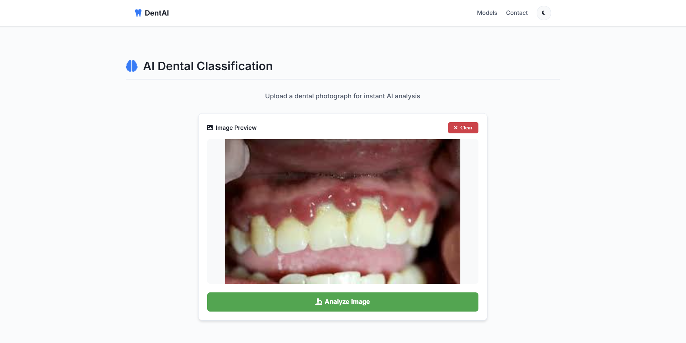
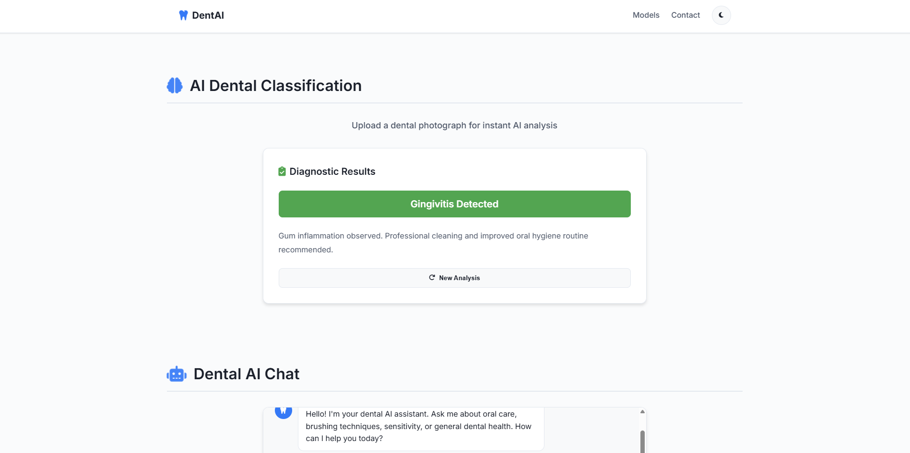
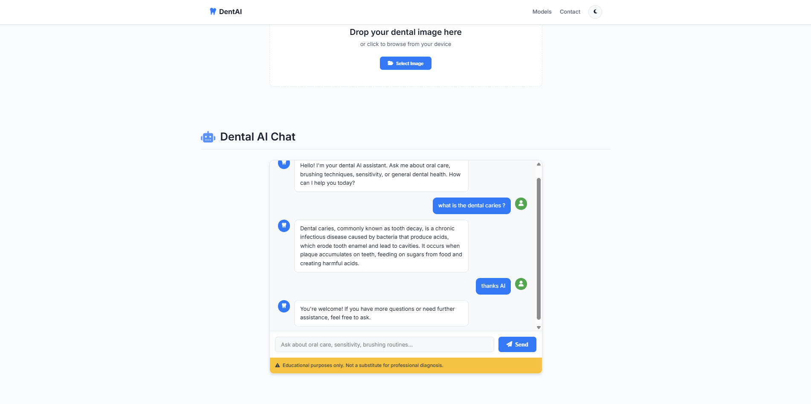
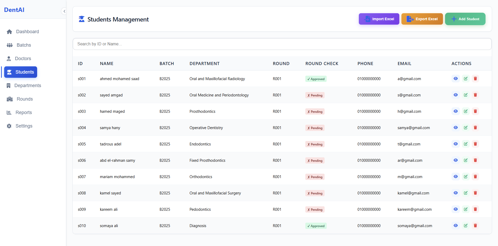
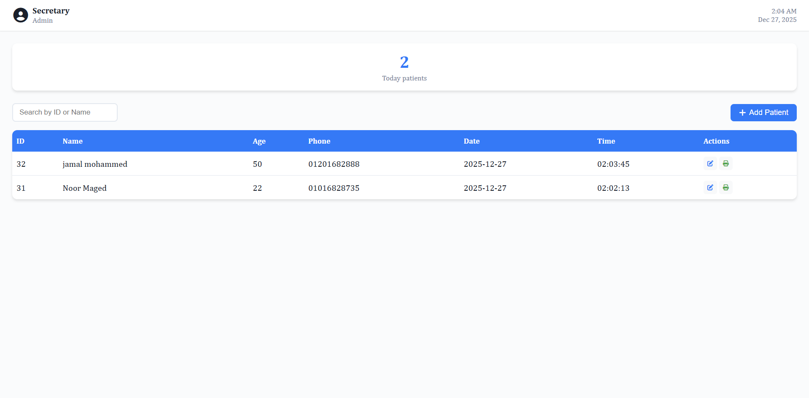
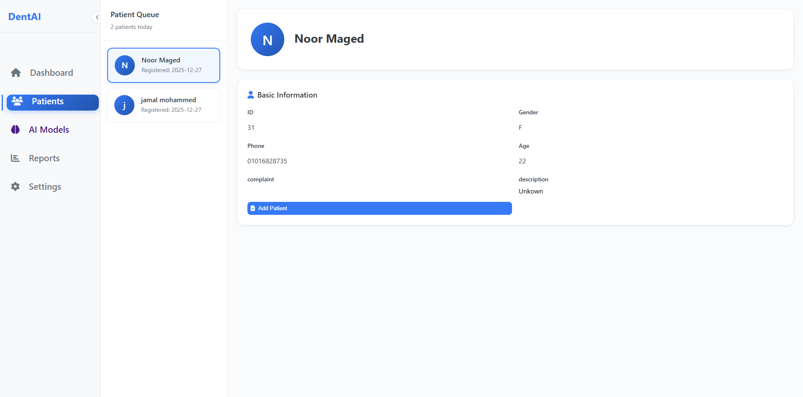
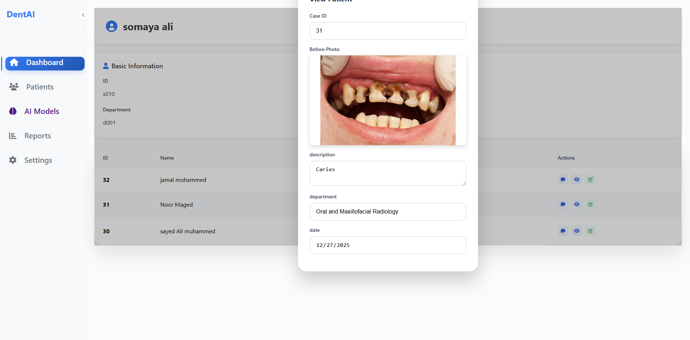
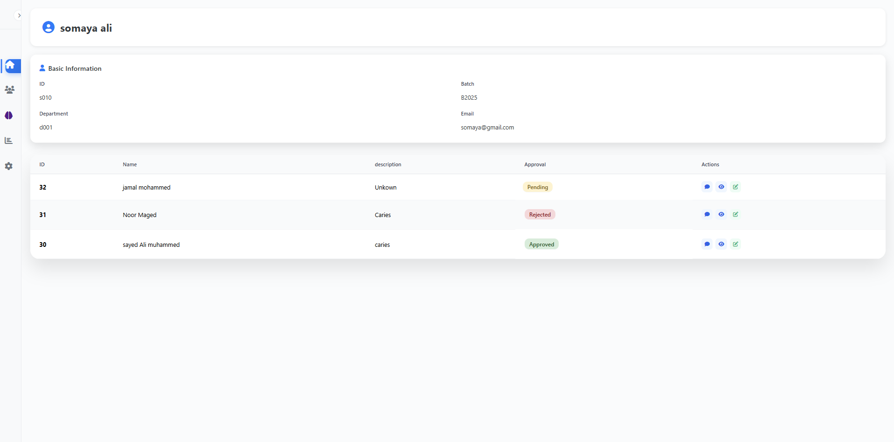
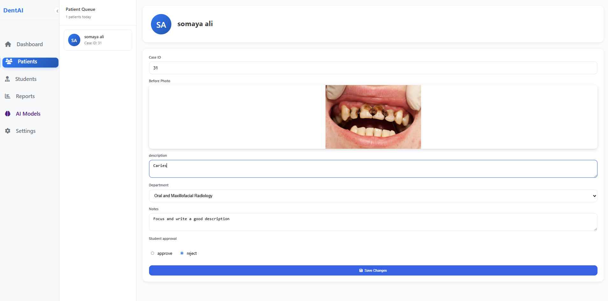

# 🦷 DentAl Hospital System
---

## 🦷 Project Overview
The **DentAl Hospital System** is an intelligent, unified healthcare management platform designed for the **Faculty of Dentistry**.  
It aims to revolutionize dental education and patient care by integrating **Artificial Intelligence (AI)** with modern web technologies.

The system creates a seamless ecosystem that:
- Enhances learning outcomes for students  
- Streamlines clinical workflows  
- Improves the overall patient experience  

---

##  Key Intelligent Features

The platform incorporates two core AI-driven components:

###  Deep-Learning Image Classification Model
Assists in diagnosing **six dental conditions** with high accuracy:
- **Calculus** (الجير)
- **Caries** (التسوس)
- **Gingivitis** (التهاب اللثة)
- **Hypodontia** (نقص عدد الأسنان)
- **Mouth Ulcers** (قرحة الفم)
- **Tooth Discoloration** (تغير لون الأسنان)

  
  

---
###  Dental AI Chatbot (SciReason-LFM2-2.6B)
- Fine-tuned **Large Language Model (LLM)** based on **LiquidAI**
- Trained using **Unsloth** on scientific reasoning datasets
- Uses a **RAG (Retrieval-Augmented Generation)** pipeline
- Provides **evidence-based clinical answers** using real medical knowledge stored in the system

---

## 👥 Stakeholders & Features

### 1️⃣ College Administration
- **User Management:** Add students, assign unique passwords, and manage specialist doctor data  
- **Academic Organization:** Create student batches and assign students to supervising doctors  
- **Reporting:** Generate detailed student performance reports and track case distribution  

---

### 2️⃣ Secretaries
- **Patient Registration:** Register new patients in the system  
- **Automated Documentation:** Generate printable patient information sheets  

---

### 3️⃣ Internship Students (Excellence Year)
Students are distributed across **10 medical departments**.

- **Diagnostic Workflow:**  
  - Receive patients  
  - Perform initial diagnosis  
  - Capture *Before* photos  
  - Assign cases to treatment departments  

- **Treatment Workflow:**  
  - Review transferred cases  
  - Apply treatment plans  
  - Capture *After* photos  

- **Performance Dashboard:**  
  - Total cases count  
  - Approved / Rejected cases  
  - Visual analytics and progress charts  

  
  

---

### 4️⃣ Specialist Doctors & Teaching Assistants
- **Case Review:** View student-submitted cases with photos and clinical notes  
- **Clinical Oversight:** Approve, reject, or modify diagnoses and treatments  
- **Student Monitoring:** Track performance and case load of supervised students  

---

### 5️⃣ Patients
- **Secure Access:** Login using Patient ID or Phone Number  
- **Digital Health Records:** View diagnosis and treatment history  
- **Downloadable Reports:** Generate and download medical reports as **PDF files**  

---

##  Tech Stack

- **Backend:** FastAPI (Python)  
- **Frontend:** HTML, CSS, JavaScript  
- **Database:** SQL  
- **AI / ML:** PyTorch, Unsloth, LiquidAI (LFM2-2.6B)  
- **Data Processing:** Pandas, NumPy  

---

##  System Workflow

1. **Entry:** Secretary registers the patient and prints an ID sheet  
2. **Diagnosis:** Diagnostic intern performs an initial assessment with AI support  
3. **Approval:** Specialist reviews and approves the diagnosis  
4. **Treatment:** Case is transferred to a treatment department intern  
5. **Final Review:** Specialist approves the completed case  

---

##  Developed By
- **Abdelrahman Ali**  
- **Yahia Mahmoud**  
- **Ahmed Saad**  
- **Yahya Mohammed**  
- **David Mamdouh**
